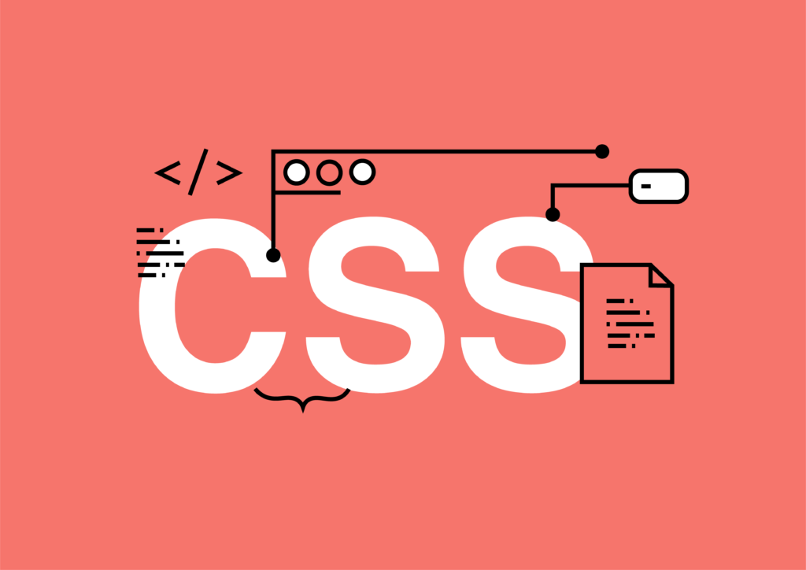

# CSS

CSS (Cascading Style Sheets) is a style sheet language used to define the look and formatting of a web document written in HTML or XML (including XML dialects such as SVG or XHTML). It defines the presentation of HTML elements on a web page. CSS is used for defining styles for fonts, colors, layout, and other aspects of web pages and user interfaces.

## How to add style to an element

To add style to an element using CSS, you will need to use selectors and declarations. Selectors are used to target the HTML elements that you want to style, and declarations are used to define the styling of those elements.

## What is a class

A class is a CSS selector that can be used to select HTML elements with the same class name. The class name can be used to group elements that share similar characteristics, styling, and behavior.

## What is a selector

A selector is a pattern that is used to select HTML elements in CSS. Selectors are used to target the elements that you want to style in your web page.

## How to compute CSS Specificity Value

In CSS, specificity is a value assigned to a selector that determines how it is applied to an element. Specificity is calculated by counting the number of HTML elements, classes, and IDs that are used in the selector. The higher the specificity value of a selector, the more likely it is to be applied to an element. 

To calculate the specificity value of a selector, count the number of HTML elements, classes, and IDs in the selector. Each element, class, and ID is assigned a value of 1, and then these values are added together to get the specificity value. 

## What are Box properties in CSS

Box properties are properties in CSS that are used to control the layout and size of elements on a web page. These properties include width, height, margin, padding, border, and display.

## How does the browser load a webpage

When a user requests a web page, the browser will send a request to the web server. The web server will then send back the HTML document to the browser. The browser will then parse the HTML document and render the page. Once the page is rendered, the browser will then request any additional assets such as images, scripts, and stylesheets. Once all the assets are loaded, the page is ready to be viewed by the user.